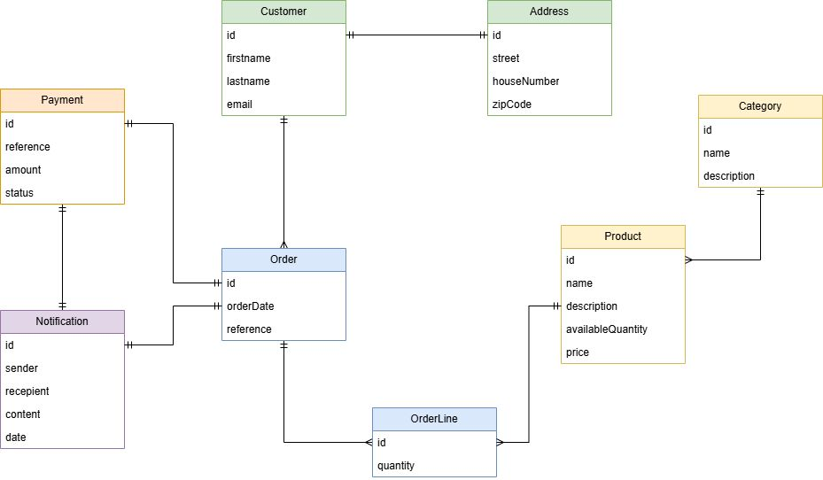
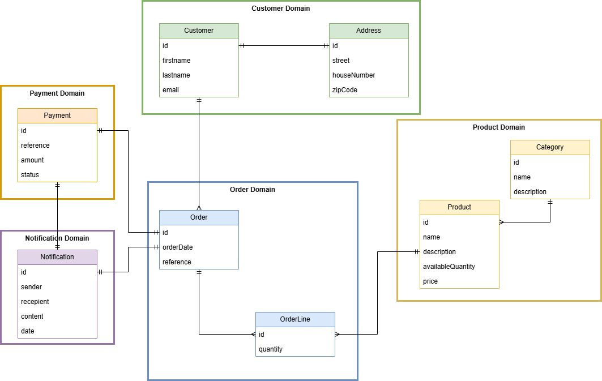

# E-commerce: Scalable Order Management System 🌟

 

Welcome to **E-commerce**, a modern e-commerce platform designed as a scalable Order Management System using a microservices architecture. Built with **Spring Boot 3** and **Spring Cloud**, e-commerce ensures high performance, scalability, and seamless integration for e-commerce applications.

## 🚀 Project Overview

e-commerce is an e-commerce platform that leverages microservices to manage various aspects of an online shopping system, including customer data, product catalogs, order processing, payments, and notifications. The system is designed to be cloud-native, distributed, and highly scalable, making it a perfect solution for modern e-commerce needs.

### 🎯 Key Features
- **Microservices Architecture**: Modular and independent services for better scalability and maintainability.
- **Real-Time Communication**: Asynchronous messaging using Kafka for seamless interaction between services.
- **Distributed Tracing**: Zipkin integration for observability and monitoring of requests across services.
- **Centralized Configuration**: Config Server for managing configurations across all microservices.
- **Secure Access**: Keycloak for identity and access management.
- **Database Strategy**: MongoDB for flexible document storage and PostgreSQL for relational data.
- **Containerized Deployment**: Docker for efficient and scalable deployment.

## 🔧 Technologies Used
- **Spring Boot 3** & **Spring Cloud**: For building and managing a distributed system.
- **Apache Kafka**: For real-time asynchronous communication between microservices.
- **Zipkin**: For distributed tracing and observability.
- **Config Server**: For centralized configuration management.
- **API Gateway**: Single entry point for all client requests.
- **Keycloak**: For secure authentication and authorization.
- **MongoDB**: NoSQL database for flexible data storage.
- **PostgreSQL**: Relational database for structured data.
- **Docker**: For containerized deployment and scalability.
- **Eureka Server**: For service discovery and registration.

## 🛠 Microservices in e-commerce

e-commerce is composed of the following microservices, each responsible for a specific domain:

1. **Customer Service**  
   - Manages customer data such as first name, last name, and email.
   - Linked to the Address service for storing customer addresses (street, house number, zip code).

2. **Product Service**  
   - Handles product and category management.
   - Manages product details like name, description, available quantity, and price.
   - Linked to the Category service for product categorization.

3. **Order Service**  
   - Manages order processing and tracking.
   - Stores order details such as order date and reference.
   - Linked to the OrderLine service for managing individual items in an order (quantity).

4. **Payment Service**  
   - Validates payments asynchronously using Kafka.
   - Stores payment details like reference, amount, and status.

5. **Notification Service**  
   - Sends real-time updates and notifications to users.
   - Stores notification details such as sender, recipient, content, and date.

### Entity-Relationship Diagram (ERD)



### Domain-Driven Design (DDD) Diagram



Below is the ERD for e-commerce, illustrating the relationships between entities across different domains:

- **Customer Domain**:
  - `Customer` (id, firstname, lastname, email) ↔ `Address` (id, street, houseNumber, zipCode)
- **Product Domain**:
  - `Product` (id, name, description, availableQuantity, price) ↔ `Category` (id, name, description)
- **Order Domain**:
  - `Order` (id, orderDate, reference) ↔ `OrderLine` (id, quantity)
  - `Order` is linked to `Customer`, `Payment`, and `Notification`.
- **Payment Domain**:
  - `Payment` (id, reference, amount, status)
- **Notification Domain**:
  - `Notification` (id, sender, recipient, content, date)

### 🖼️ Architecture Diagram

The architecture diagram showcases how e-commerce's microservices interact with each other:

- **API Gateway**: Acts as the entry point for all client requests, routing them to the appropriate microservice (`/customers`, `/products`, `/orders`).
- **Service Discovery**: Eureka Server for registering and discovering microservices.
- **Asynchronous Communication**: Kafka enables real-time messaging (e.g., "Send Payment Confirmation" and "Send Order Confirmation").
- **Distributed Tracing**: Zipkin tracks requests across microservices for better observability.
- **Database**: MongoDB for most services, with PostgreSQL used where relational data is needed.
- **Configuration**: Config Server for centralized configuration management.

## 🏗️ Project Structure

The project is divided into multiple microservices, each with its own domain and responsibilities. The domains are:

- **Customer Domain**: Manages customer and address data.
- **Product Domain**: Manages products and categories.
- **Order Domain**: Handles orders and order lines.
- **Payment Domain**: Processes payments.
- **Notification Domain**: Sends notifications.

Each microservice is a standalone Spring Boot application, containerized using Docker, and communicates via Kafka for asynchronous events.

## 🚀 Getting Started

### Prerequisites
- Java 17 or later
- Maven
- Docker
- MongoDB
- PostgreSQL
- Apache Kafka
- Keycloak
- Zipkin

### Setup Instructions

1. **Clone the Repository**:
   ```bash
   git clone https://github.com/AmrElsebaey/e-commerce.git
   cd e-commerce
   ```

2. **Set Up Configuration**:
   - Start the Config Server to manage configurations for all microservices.
   - Update the configuration files in the Config Server with your environment-specific settings (e.g., database URLs, Kafka broker, etc.).

3. **Run Dependencies**:
   - Start MongoDB, PostgreSQL, Kafka, Keycloak, and Zipkin using Docker:
     ```bash
     docker-compose up -d
     ```

4. **Start Eureka Server**:
   - Navigate to the `eureka-server` directory and run:
     ```bash
     mvn spring-boot:run
     ```

5. **Start Microservices**:
   - Start each microservice (Customer, Product, Order, Payment, Notification) by navigating to their respective directories and running:
     ```bash
     mvn spring-boot:run
     ```

6. **Access the API Gateway**:
   - The API Gateway will be available at `http://localhost:8080`.
   - Example endpoints:
     - `/customers` for customer-related operations.
     - `/products` for product-related operations.
     - `/orders` for order-related operations.

7. **Monitor with Zipkin**:
   - Access Zipkin at `http://localhost:9411` to view distributed tracing data.

## 📈 Future Improvements
- Add support for Kubernetes for orchestration and scaling.
- Implement CI/CD pipelines for automated deployment.
- Enhance security with advanced Keycloak configurations.
- Add more advanced analytics and reporting features.

## 🎯 Learning Outcomes
e-commerce has been a fantastic learning experience, helping me deepen my expertise in:
- Microservices architecture and best practices.
- Cloud-native solutions using Spring Cloud.
- Distributed systems and asynchronous communication with Kafka.
- Observability and monitoring with Zipkin.
- Containerization and deployment with Docker.
